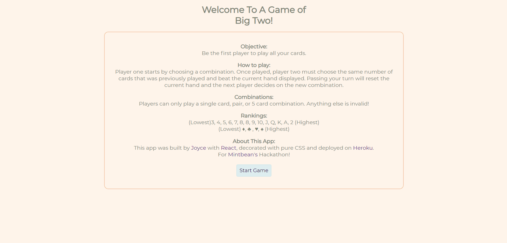

# Big Two

A card game called Big Two for Mintbean.io's Hackathon. Built with React, JS, CSS. 

### Big Two Preview

### Installation and Setup Instructions

You will need `node` and `npm` installed globally on your machine.

Installation:
`npm install`

Start Server:
`npm start`

View App:
Open [http://localhost:3000/](http://localhost:3000/)

### Reflection
This project was made for Mintbean's Jr Web Dev Hackathon in which a week's time was given to create a card game.
Shortly after learning React, I was introduced to this Hackathon and thought it would be a great side project to challenge myself in a short amount of time as well as familiarizing myself with React. Having started late, I had doubts on whether I could writing the game logic in such a short period of time, but it turned out to be fine! :) 

- A problem that was frequently encountered was implementing logic that required state to be updated. 
- This led me to using functions and work-arounds to solve this problem. 
- This project could use additional hints/help during game play.

### This project was made solo by Joyce Wong! 
- [Linkedin](https://www.linkedin.com/in/hello-joycewong/)
- [GitHub](https://github.com/Joyce-w)